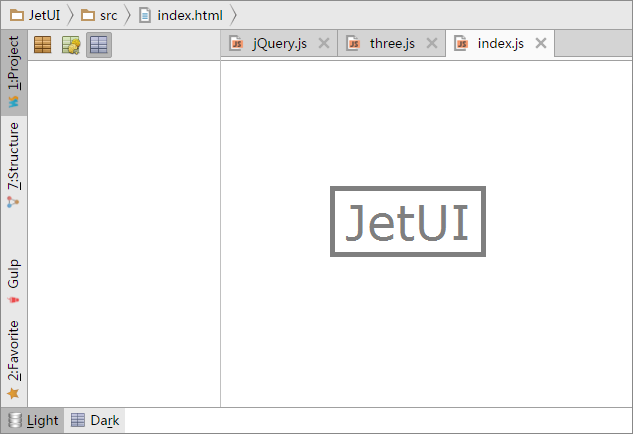

# jet-ui

A JetBrain-style UI widget set based on Vue.js

[Demo](http://jarvisniu.com/JetUI/ide.html) -
[Widget Gallery](http://jarvisniu.com/JetUI/)

[](http://jarvisniu.com/JetUI/ide.html)


## Usage

Prerequisite: [Node](https://nodejs.org/), [Gulp](http://gulpjs.com/)

```
npm install
gulp run
```

## Specification

- Support theme
- Support high-definition screen / zoom

## Components

- Icon Label
- Image Button
- Side Panel
- Tab Bar
- Tab Button
- Toolbar
- Togglebar
- Splitter
- Breadcrumb
- Rotated Panel

### Planning

- Menu
- Tree View

## License

MIT
